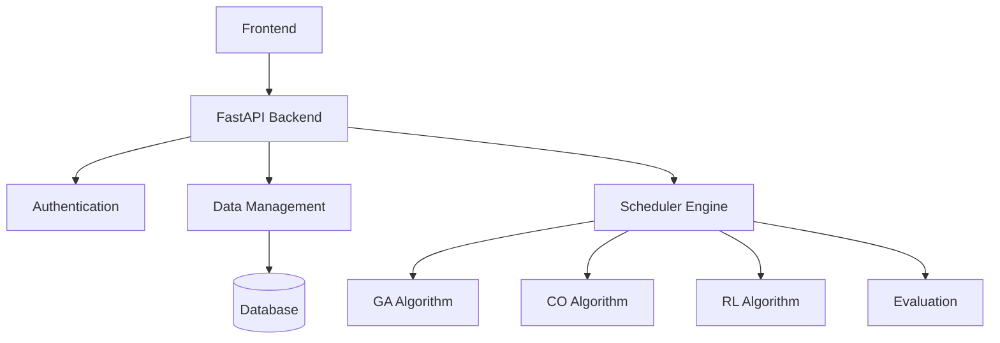
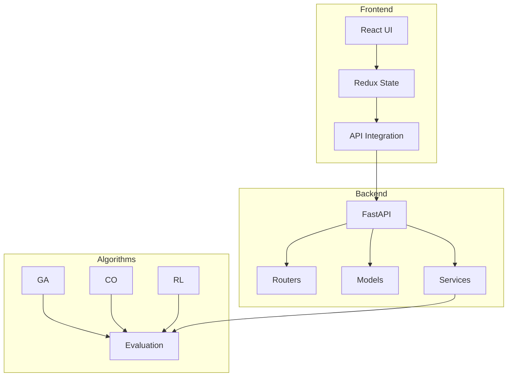
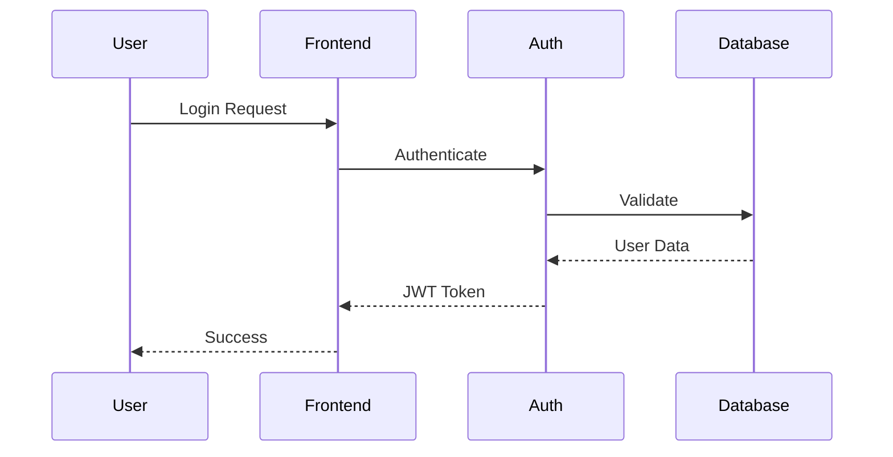

# University Scheduler Backend

## Project Description
The University Scheduler Backend is an advanced timetable scheduling system that uses multiple AI algorithms to generate optimal schedules for universities. The system employs Genetic Algorithms (GA), Constraint Optimization (CO), Reinforcement Learning (RL), and comprehensive evaluation metrics to create conflict-free timetables while considering various constraints.

## System Architecture



## Component Architecture



## Authentication Flow



## Setup Instructions

### Prerequisites
- Python 3.8+
- MongoDB
- Virtual Environment

### Installation Steps
```bash
# Clone the repository
git clone https://github.com/your-repo/university-scheduler-backend.git
cd university-scheduler-backend

# Create and activate virtual environment
python -m venv venv
source venv/bin/activate  # Linux/Mac
.\venv\Scripts\activate   # Windows

# Install dependencies
pip install -r requirements.txt

# Run the application
uvicorn main:app --reload
```

## Project Structure
```
university-scheduler-backend/
├── generator/
│   ├── algorithms/
│   │   ├── ga/
│   │   ├── co/
│   │   ├── rl/
│   │   └── eval/
│   └── data_collector.py
├── models/
├── routers/
├── services/
├── utils/
└── data_insertion/
```

## Team Members and Responsibilities

### Member 1 - Authentication & GA Algorithm
- **Components**:
  - /models/user_model.py
  - /models/info_model.py
  - /routers/user_router.py
  - /generator/algorithms/ga/
- **Responsibilities**:
  - User authentication
  - JWT implementation
  - GA Algorithm optimization

### Member 2 - Academic Structure & CO Algorithm
- **Components**:
  - /models/year_model.py
  - /models/faculty_model.py
  - /routers/year_routes.py
  - /generator/algorithms/co/
- **Responsibilities**:
  - Academic year management
  - Faculty operations
  - CO Algorithm development

### Member 3 - Resource Management & RL Algorithm
- **Components**:
  - /models/activity_model.py
  - /models/space_model.py
  - /routers/activity_routes.py
  - /generator/algorithms/rl/
- **Responsibilities**:
  - Activity scheduling
  - Space allocation
  - RL Algorithm implementation

### Member 4 - Timetable & Algorithm Evaluation
- **Components**:
  - /models/timetable_model.py
  - /models/constraint_model.py
  - /routers/timetable_routes.py
  - /generator/algorithms/eval/
- **Responsibilities**:
  - Timetable generation
  - Constraint management
  - Algorithm evaluation

## API Documentation
API documentation is available at `/docs` when running the server.

## Contributing
1. Create a feature branch
2. Make your changes
3. Write/update tests
4. Submit a pull request

## License
MIT License
