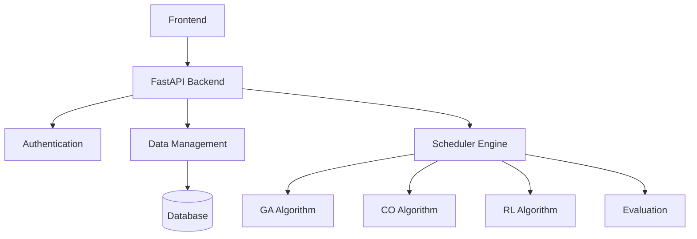

# University Scheduler Backend

## Project Description
The University Scheduler Backend is an advanced timetable scheduling system that uses multiple AI algorithms to generate optimal schedules for universities. The system employs Genetic Algorithms (GA), Constraint Optimization (CO), Reinforcement Learning (RL), and comprehensive evaluation metrics to create conflict-free timetables while considering various constraints.

## Architecture

### System Overview 



### Installation Steps  

git clone https://github.com/your-repo/university-scheduler-backend.git
cd university-scheduler-backend


python -m venv venv
source venv/bin/activate  # Linux/Mac
.\venv\Scripts\activate   # Windows


pip install -r requirements.txt

fastapi dev run


## API Documentation
API documentation is available at `/docs` when running the server.


## Detailed Architecture

### Component Interaction
```mermaid
graph TD
    subgraph Frontend
        A[React UI] --> B[Redux State]
        B --> C[API Integration]
    end
    
    subgraph Backend
        D[FastAPI] --> E[Routers]
        D --> F[Models]
        D --> G[Services]
        
        subgraph Algorithms
            H[Genetic Algorithm]
            I[Constraint Optimization]
            J[Reinforcement Learning]
            K[Evaluation Metrics]
        end
        
        subgraph Data
            L[MongoDB]
            M[Data Insertion]
            N[Data Validation]
        end
    end
    
    C --> D
    E --> L
    F --> L  


### Authentication Flow 

sequenceDiagram
    participant U as User
    participant F as Frontend
    participant A as Auth Service
    participant D as Database
    
    U->>F: Login Request
    F->>A: Authenticate
    A->>D: Validate Credentials
    D-->>A: User Data
    A-->>F: JWT Token
    F-->>U: Auth Success


### Scheduling Process

graph TD
    A[Input Data] --> B[Data Collector]
    B --> C{Algorithm Selection}
    C --> D[GA]
    C --> E[CO]
    C --> F[RL]
    D --> G[Evaluation]
    E --> G
    F --> G
    G --> H[Best Schedule]
    H --> I[Output]

